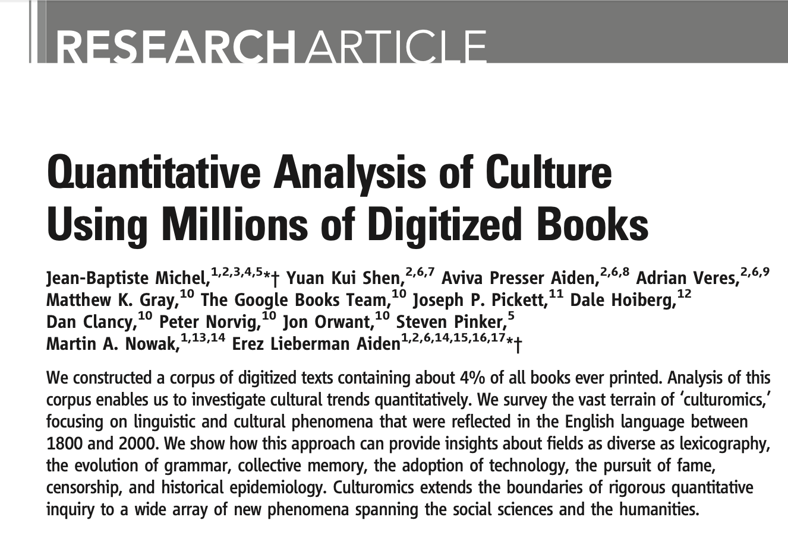
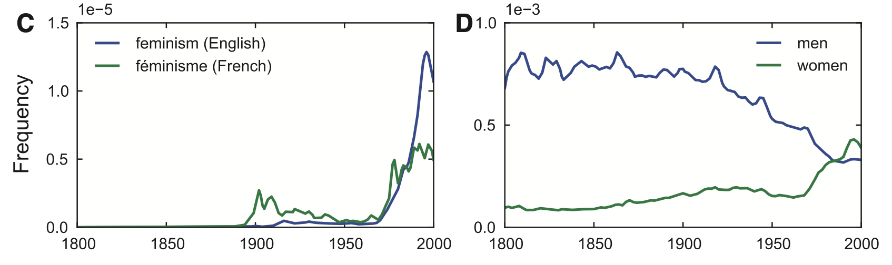
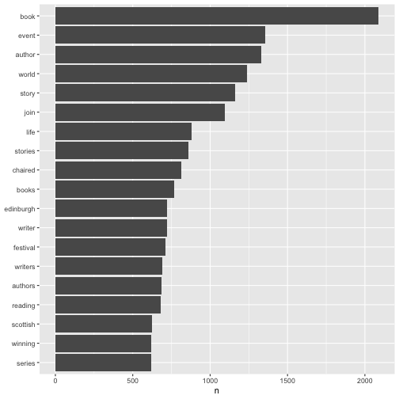
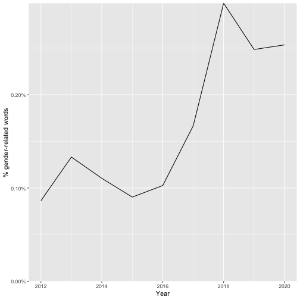

Word frequencies
========================================================
author: Christopher Barrie 
date: University of Edinburgh
width: 1800
height: 900
transition: none  
  website: https://cjbarrie.xyz     
  github: https://github.com/cjbarrie       
  Twitter: https://www.twitter.com/cbarrie
  
Word frequency analysis
========================================================

- Tokenizing
- Counting words over space/time

========================================================

<center>

</center>

Word frequency analysis
========================================================


```r
head(bookdata)
```

```
# A tibble: 6 x 1
  txt                  
  <chr>                
1 "PRIDE AND PREJUDICE"
2 ""                   
3 "By Jane Austen"     
4 ""                   
5 ""                   
6 ""                   
```

Word frequency analysis
========================================================


```r
bookdata %>%
  unnest_tokens(word, txt) %>%
  count(word, sort=T)
```

```
# A tibble: 6,538 x 2
   word      n
   <chr> <int>
 1 the    4331
 2 to     4162
 3 of     3610
 4 and    3585
 5 her    2203
 6 i      2065
 7 a      1954
 8 in     1880
 9 was    1843
10 she    1695
# … with 6,528 more rows
```

========================================================

<center>

</center>
- Source: Michel et al. 2011. "Quantitative Analysis of Culture Using Millions of Digitized Books," *Science*, 331(6014):176-182.

Running Your First Analysis: Edinburgh Book Festival
========================================================

```r
library(tidyverse) # loads dplyr, ggplot2, and others
library(tidytext) # includes set of functions useful for manipulating text
library(readr) # more informative and easy way to import data

edbfdata <- read_csv("https://raw.githubusercontent.com/cjbarrie/RDL-Ed/main/02-text-as-data/data/edbookfestall.csv")
```


Getting event descriptions
========================================================

```r
# get simplified dataset with only event contents and year
evdes <- edbfdata %>%
  select(description, year)

glimpse(evdes)
```

```
Rows: 5,938
Columns: 2
$ description <chr> "<p>\n\tAs the grande dame of Scottish crime fiction, Deni…
$ year        <dbl> 2012, 2012, 2012, 2012, 2012, 2012, 2012, 2012, 2012, 2012…
```


Tidying into tokens
========================================================

```r
tidy_des <- evdes %>% 
  mutate(desc = tolower(description)) %>%
  unnest_tokens(word, description) %>%
  filter(str_detect(word, "[a-z]"))
```


Removing stop words
========================================================

```r
tidy_des <- tidy_des %>%
    filter(!word %in% stop_words$word)
```

Checking data
========================================================

```r
tidy_des %>%
  count(word, sort = TRUE)
```

```
# A tibble: 24,995 x 2
   word       n
   <chr>  <int>
 1 rsquo   5638
 2 book    2088
 3 event   1356
 4 author  1332
 5 world   1240
 6 story   1159
 7 join    1095
 8 em      1064
 9 life     879
10 strong   864
# … with 24,985 more rows
```


Further cleaning
========================================================

```r
#remove punctuation
remove_reg <- c("&amp;","&lt;","&gt;","<p>", "</p>","&rsquo", "&lsquo;",  "&#39;", "<strong>", "</strong>", "rsquo", "em", "ndash", "nbsp", "lsquo", "strong")
reg_match <- str_c(remove_reg, collapse = "|")
                  
tidy_des <- tidy_des %>%
  filter(!word %in% remove_reg)
```

Checking data again
========================================================

```r
tidy_des %>%
  count(word, sort = TRUE)
```

```
# A tibble: 24,989 x 2
   word        n
   <chr>   <int>
 1 book     2088
 2 event    1356
 3 author   1332
 4 world    1240
 5 story    1159
 6 join     1095
 7 life      879
 8 stories   860
 9 chaired   815
10 books     767
# … with 24,979 more rows
```

Compute counts for plotting
========================================================

```r
tidy_wf_plot <- tidy_des %>%
  count(word, sort = TRUE) %>%
  filter(n > 600) %>%
  mutate(word = reorder(word, n))
```

Plot
========================================================


```r
ggplot(tidy_wf_plot, aes(n, word)) +
  geom_col() +
  labs(y = NULL)
```



Tag target words
========================================================


```r
edbf_term_counts <- tidy_des %>% 
  group_by(year) %>%
  count(word, sort = TRUE)
```


```r
edbf_term_counts$womword <- as.integer(grepl("women|gender",
                                             x = edbf_term_counts$word))
```

Count words as proportion of total
========================================================

```r
edbf_counts <- edbf_term_counts %>%
  complete(year, word, fill = list(n = 0)) %>%
  group_by(year) %>%
  mutate(year_total = sum(n)) %>%
  filter(womword==1) %>%
  summarise(sum_wom = sum(n),
            year_total= min(year_total))
```

Plot
========================================================

```r
ggplot(edbf_counts, aes(year, sum_wom / year_total, group=1)) +
  geom_line() +
  xlab("Year") +
  ylab("% gender-related words") +
  scale_y_continuous(labels = scales::percent_format(),
                     expand = c(0, 0), limits = c(0, NA))
```


