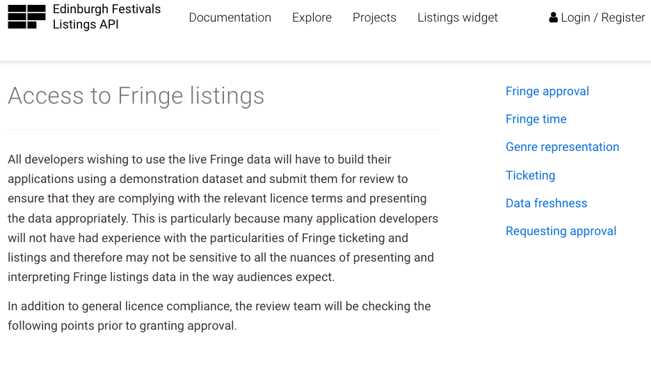

# Exercise 1: Word frequency analysis

The hands-on exercise for this week uses a different source of data, and here I introduce you to how we might gather, clean, and analyze text data. In so doing, I also refer to the article by @nelson_computational_2020, and the steps she proposes for a "grounded" approach to the analysis of text data. The argument @nelson_computational_2020 makes is that we can use computational techniques for the discovery of topics within text, and then employ more interpretative techniques to analyze meaning in the text itself. Here, we will be mainly focusing on what @nelson_computational_2020 refers to as "lexical-based techniques," though we will also have the chance to perform a simple classification task. 

## Introduction

In this tutorial, you will learn how to summarise, aggregate, and analyze text in R:

* How to summarise tables with `summarise()` 
* How to use the pipe (`%>%`) operators with dplyr from the tidyverse
* How to summarise groups of observations with `group_by()` and `summarise()`
* How to visualize results with ggplot
* How to tidy text with tidytext functions
* How to perform automated gender assignment from name data (and think about possible biases these methods may enclose)

## Setup 

To practice these skills, we will use a dataset that has already been collected from the Edinburgh Fringe Festival website. You can try this out yourself too: to obtain these data, you must first obtain an API key. Instructions on how to do this are available at the [Edinburgh Fringe API page](https://api.edinburghfestivalcity.com/documentation/fringe_approval):



This might sound complicated but it isn't really. In essence, APIs simply provide data in a more usable format without the need for alternative techniques such as web scraping. Be warned, too, that some websites do not permit automated web scraping, meaning the use of an API is essential.

##  Load data and packages 

Before proceeding, we'll load the remaining packages we will need for this tutorial.

```{r, message=F}
library(tidyverse) # loads dplyr, ggplot2, and others
library(tidytext) # includes set of functions useful for manipulating text
library(ggthemes) # includes a set of themes to make your visualizations look nice!
library(readr) # more informative and easy way to import data
library(babynames) #for gender predictions
```

For this tutorial, we will be using data that I have pre-cleaned and provided in .csv format. The data come from the Edinburgh Book Festival API, and provide data for every event that has taken place at the Edinburgh Book Festival, which runs every year in the month of August, for nine years: 2012-2020. There are many questions we might ask of these data. In this tutorial, we will investigate the contents of each event, and the speakers at each event, to determine if there are any trends in gender representation over time.

The first task, then, is to read in these data. We can do this with the `read_csv()` function.

The `read_csv()` function takes the .csv file and loads it into the working environment as a data frame object called "edbfdata." We can call this object anything though. Try changing the name of the object before the <- arrow. Note that R does not allow names with spaces in, however. It is also not a good idea to name the object something beginning with numbers, as this means you have to call the object within ` marks.

```{r}
edbfdata <- read_csv("data/edbookfestall.csv")
```

If you're working on this document from your own computer ("locally") you can download the Edinburgh Fringe data in the following way:

```{r, eval = F}
edbfdata <- read_csv("https://raw.githubusercontent.com/cjbarrie/RDL-Ed/main/02-text-as-data/data/edbookfestall.csv")
```


## Inspect and filter data 

Our next job is to cut down this dataset to size, including only those columns that we need. But first we can inspect it to see what the existing column names are, and how each variable is coded. To do this we can first call:

```{r}
colnames(edbfdata)
```

And then: 

```{r}
glimpse(edbfdata)
```

We can see that the description of each event is included in a column named "description" and the year of that event as "year." So for now we'll just keep these two. Remember: we're interested in this tutorial firstly in the representation of gender and feminism in forms of cultural production given a platform at the Edinburgh International Book Festival. Given this, we are first and foremost interested in the reported content of each artist's event.

We use pipe `%>%` functions in the tidyverse package to quickly and efficiently select the columns we want from the edbfdata data.frame object. We pass this data to a new data.frame object, which we call "evdes."

```{r}
# get simplified dataset with only event contents and year
evdes <- edbfdata %>%
  select(description, year)

head(evdes)
```

And let's take a quick look at how many events there were over time at the festival. To do this, we first calculate the number of individual events (row observations) by year (column variable).

```{r, echo=T, warning=F}
evtsperyr <- evdes %>%
  mutate(obs=1) %>%
  group_by(year) %>%
  summarise(sum_events = sum(obs))
```

And then we can plot this using ggplot!

```{r, echo=T, warning=F}
ggplot(evtsperyr) +
  geom_line(aes(year, sum_events)) +
  theme_tufte(base_family = "Helvetica") + 
  scale_y_continuous(expand = c(0, 0), limits = c(0, NA))
```

Perhaps unsurprisingly, in the context of the pandemic, the number of recorded bookings for the 2020 Festival is drastically reduced. 

## Tidy the text 

Given that these data were obtained from an API that outputs data originally in HTML format, some of the text still contains some HTML and PHP encodings for e.g. bold font or paragraphs. We'll need to get rid of this, as well as other punctuation before analyzing these data.

The below set of commands takes the event descriptions, extracts individual words, and counts the number of times they appear in each of the years covered by our book festival data. 

```{r}
#get year and word for every word and date pair in the dataset
tidy_des <- evdes %>% 
  mutate(desc = tolower(description)) %>%
  unnest_tokens(word, desc) %>%
  filter(str_detect(word, "[a-z]"))

```

We see that the resulting dataset is large (~293k rows). This is because the above commands have first taken the pamphlet text, and has "mutated" it into a set of lower case character string. With the "unnest_tokens" function it has then taken each individual string and create a new column called "word" that contains each individual word contained in the pamphlet texts.

We can yet tidy this further, though. First we'll remove all stop words:

```{r}
tidy_des <- tidy_des %>%
    filter(!word %in% stop_words$word)
```

Some terminology is also appropriate here. When we tidy our text into this format, we often refer to these data structures as consisting of "documents" and "terms." This is because by "tokenizing" our text with the "unnest_tokens" functions we are generating a dataset with one term per row. Here, our "documents" are the collection of descriptions for all events in each year at the Edinburgh Book Festival. The way in which we sort our text into "documents" depends on the choice of the individual researcher. Instead of by year, we might have wanted to sort our text into "genre." Here, we have two genres: "Literature" and "Children." Had we done so, we would then have only two "documents," which contained all of the words included in the event descriptions for each genre. Alternatively, we might be interested in the contributions of individual authors over time. Were this the case, we could have sorted our text into documents by author. In this case, each "document" would represent all the words included in event descriptions for events by the given author (many of whom do have multiple appearances over time or in the same festival for a given year).
 
We can yet tidy this further, though. First we'll remove all stop words and then we'll remove all apostrophes:

```{r}
tidy_des <- tidy_des %>%
    filter(!word %in% stop_words$word)
```

We see that the number of rows in our dataset reduces by about half to ~223k rows. This is natural since a large proportion of any string will contain many so-called "stop words". We can see what these stop words are by typing:

```{r}
stop_words
```

This is a lexicon (list of words) included in the <tt>tidytext</tt> packaged produced by Julia Silge and David Robinson (see [here](https://cran.r-project.org/web/packages/tidytext/vignettes/tidytext.html)). We see it contains over 1000 such words. We remove them here because they are not very informative if we are interested in the substantive content of text (rather than, say, its grammatical content).

Now let's have a look at the most common words in these data:

```{r}
tidy_des %>%
  count(word, sort = TRUE)
```

We can see that one of the most common words is "rsquo," which is an HTML encoding for an apostrophe. Clearly we need to clean the data a bit more. This is a common issue in large-n text analysis and is a key step if you want to conduct reliably robust forms of text analysis. We'll have another go using the the filter command, specifying that we only keep the words that are not included in the string of words `r c("rsquo", "em", "ndash", "nbsp", "lsquo") `.

```{r}
#remove punctuation
remove_reg <- c("&amp;","&lt;","&gt;","<p>", "</p>","&rsquo", "&lsquo;",  "&#39;", "<strong>", "</strong>", "rsquo", "em", "ndash", "nbsp", "lsquo", "strong")
reg_match <- str_c(remove_reg, collapse = "|")
                  
tidy_des <- tidy_des %>%
  filter(!word %in% remove_reg)

```

```{r}
tidy_des %>%
  count(word, sort = TRUE)
```

That's more like it! The words that feature most seem to make sense now (and are actual words rather than random HTML and UTF-8 encodings). 

Let's now collect these words into a data.frame object, which we'll call edbf_term_counts:

```{r}
edbf_term_counts <- tidy_des %>% 
  group_by(year) %>%
  count(word, sort = TRUE)
```

```{r}
head(edbf_term_counts)
```

For each year, we see that "book" is the most common word... perhaps no surprises here. But this is some evidence that we're properly pre-processing and cleaning the data. Cleaning text data is an important element of preparing for any text analysis. It is often a process of trial and error as not all text data looks alike, may come from e.g. webpages with HTML encoding, unrecognized fonts or unicode, and all of these have the potential to cause issues! But finding these errors is also a chance to get to know your data...

## Analyze keywords 

Okay, now we have our list of words, and the number of times they appear, we can tag those words we think might be related to issues of gender inequality and sexism. You may decide that this list is imprecise or inexhaustive. If so, then feel free to change the terms we are including after the `grepl()` function. 

```{r}
edbf_term_counts$womword <- as.integer(grepl("women|feminist|feminism|gender|harassment|sexism|sexist", 
                                            x = edbf_term_counts$word))
```

```{r}
head(edbf_term_counts)
```

## Compute aggregate statistics 

Now that we have tagged individual words relating to gender inequality and feminism, we can sum up the number of times these words appear each year and then denominate them by the total number of words in the event descriptions.

The intuition here is that any increase or decrease in the percentage of words relating to these issues is capturing a substantive change in the representation of issues related to sex and gender.

What do we think of this measure? Is this an adequate measure of representation for such issues in the cultural sphere?

Are the keywords we used precise enough? If not, what would you change?

```{r}
#get counts by year and word
edbf_counts <- edbf_term_counts %>%
  complete(year, word, fill = list(n = 0)) %>%
  group_by(year) %>%
  mutate(year_total = sum(n)) %>%
  filter(womword==1) %>%
  summarise(sum_wom = sum(n),
            year_total= min(year_total))
```

```{r}
head(edbf_counts)
```

## Plot time trends 

So what do we see? Let's take the count of words relating to gender in this dataset, and denominate them by the total number of words in these data per year. 

```{r, warning=F}
ggplot(edbf_counts, aes(year, sum_wom / year_total, group=1)) +
  geom_line() +
  xlab("Year") +
  ylab("% gender-related words") +
  scale_y_continuous(labels = scales::percent_format(),
                     expand = c(0, 0), limits = c(0, NA)) +
  theme_tufte(base_family = "Helvetica") 
```

In the above, we are looking at the proportions of gender-related words over time as a proportion of total words in each year. @nelson_computational_2020 recommends looking into differences in proportions between years or between documents. This is also straightforward to compute. We can understand each year as an individual "document" containing a "bag of words." To compute the differences in proportions year on year, we need calculate the difference by subtracting the proportion of year y from year y+1. 

```{r}

edbf_diffs <- edbf_counts %>%
  mutate(prop = sum_wom/year_total,
         prop_y1 = lag(prop),
         diffprop = ifelse(!is.na(prop_y1), prop-prop_y1, prop))

ggplot(edbf_diffs, aes(year, diffprop, group=1)) +
  geom_line() +
  xlab("Year") +
  ylab("year-on-year difference in % gender-related words") +
  scale_y_continuous(labels = scales::percent_format(),
                     expand = c(0, 0)) +
  theme_tufte(base_family = "Helvetica")
```

What do we see from this graph? Arguably this is harder to intepret, even if it does better visualize the year-on-year changes. Because we are looking at year-on-year changes, though, it means the overall trend is harder to determine. We will return to the approach we used in the second-to-last graph; that is, plotting the overall proportion of gender-related words for each year. 

We can add visual guides to draw attention to apparent changes in these data. Here, we might wish to signal the year of the #MeToo movement in 2017.

```{r, warning=F}
ggplot(edbf_counts, aes(year, sum_wom / year_total, group=1)) +
  geom_line() +
  geom_vline(xintercept = 2017, col="red") +
  xlab("Year") +
  ylab("% gender-related words") +
  scale_y_continuous(labels = scales::percent_format(),
                     expand = c(0, 0), limits = c(0, NA)) +
  theme_tufte(base_family = "Helvetica")
```

And we could label why we are highlighting the year of 2017 by including a text label along the vertical line. 

```{r, warning=F}
ggplot(edbf_counts, aes(year, sum_wom / year_total, group=1)) +
  geom_line() +
  geom_vline(xintercept = 2017, col="red") +
  geom_text(aes(x=2017.1, label="#metoo year", y=.0015), 
            colour="black", angle=90, text=element_text(size=8)) +
  xlab("Year") +
  ylab("% gender-related words") +
  scale_y_continuous(labels = scales::percent_format(),
                     expand = c(0, 0), limits = c(0, NA)) +
  theme_tufte(base_family = "Helvetica")
```

## Gender prediction

We might decide that this measure is inadequate or too expansive to answer the question at hand. Another way of measuring representation in cultural production is to measure the gender of the authors who spoke at these events.

Of course, this would take quite some time if we were to individually code each of the approximately 6000 events included in this dataset.

But there do exist alternative techniques for imputing gender based on the name of an individual. 

We first create a new data.frame object, selecting just the columns for artist name and year. Then we generate a new column containing just the artist's (author's) first name:

```{r}
# get columns for artist name and year, omitting NAs
gendes <- edbfdata %>%
  select(artist, year) %>%
  na.omit()

# generate new column with just the artist's (author's) first name
gendes$name <- sub(" .*", "", gendes$artist)
```

A set of packages called <tt>gender</tt> and <tt>genderdata</tt> used to make the process of predicting gender based on a given individual's name pretty straightforward. This technique worked with reference to  U.S. Social Security Administration baby name data. Given that the most common gender associated with a given name changes over time, the function also allows us to specify the range of years for the cohort in question whose gender we are inferring. Given that we don't know how wide the cohort of artists is that we have here, we could specify a broad range of 1920-2000.

```{r, eval =F}
genpred <- gender(gendes$name,
       years = c(1920, 2000))
```

Unfortunately, this package no longer works with newer versions of R. I have recreated it using the original "babynames" data, which comes bundled in the <tt>babynames</tt> package. You don't necessarily have to follow each step of how I have done this---I include this information for the sake of completeness.

The <tt>babynames</tt> package. contains, for each year, the number of children born with a given name, as well as their sex. With this information, we can then calculate the total number of individuals with a given name born for each sex in a given year. Given we also have the total number of babies born in total cross these records, we can denominate (divide) the sums for each name by the total number of births for each sex in each year. We can take this proportion as representing the probability that a given individual in our Edinburgh Fringe dataset is male or female. 

More information on the <tt>babynames</tt> package can be found [here](https://www.ssa.gov/oact/babynames/limits.html). 

We first load the babynames package into the R environment as a data.frame object. Because the data.frame "babynames" is contained in the <tt>babynames</tt> package we can just call it as an object and store it with `r babynames <- babynames`. This dataset contains names for all years over a period 1800--2019. The variable "n" represents the number of babies born with the given name and sex in that year, and the "prop" represents, according to the package materials accessible [here](https://cran.r-project.org/web/packages/babynames/babynames.pdf), "n divided  by  total  number  of applicants in that year, which means proportions are of people of that gender with that name born in that year."

```{r}

babynames <- babynames
head(babynames)
```

We then calculate the total number of babies of female and male sex born in each year. Then we merge these to get a combined dataset of male and female baby names by year. We then merge this information back into the original babynames data.frame object.

```{r}

totals_female <- babynames %>%
  filter(sex=="F") %>%
  group_by(year) %>%
  summarise(total_female = sum(n))

totals_male <- babynames %>%
  filter(sex=="M") %>%
  group_by(year) %>%
  summarise(total_male = sum(n))

totals <- merge(totals_female, totals_male)

totsm <- merge(babynames, totals, by = "year")
head(totsm)

```

We can then calculate, for all babies born on or after 1920, the number of babies born with that name and sex. With this information, we can then get the proportion of all babies with a given name that were of a particular sex. For example, if 92% of babies born with the name "Mary" were female, this would give us a .92 probability that an individual with the name "Mary" is female. We do this for every name in the dataset, excluding names for which the proportion is equal to .5; i.e., for names that we cannot adjudicate between whether they are more or less likely male or female.

```{r}

totprops <- totsm %>%
  filter(year >= 1920) %>%
  group_by(name, year) %>%
  mutate(sumname = sum(n),
         prop = ifelse(sumname==n, 1,
                       n/sumname)) %>%
  filter(prop!=.5) %>%
  group_by(name) %>%
  slice(which.max(prop)) %>%
  summarise(prop = max(prop),
            totaln = sum(n),
            name = max(name),
            sex = unique(sex))

head(totprops)

```

Once we have our proportions for all names, we can then merge these back with the names of our artists from the Edinburgh Fringe Book Festival. We can then easily plot the proportion of artists at the Festival who are male versus female in each year of the Festival. 

```{r}

ednameprops <- merge(totprops, gendes, by = "name")

ggplot(ednameprops, aes(x=year, fill = factor(sex))) +
  geom_bar(position = "fill") +
  xlab("Year") +
  ylab("% women authors") +
  labs(fill="") +
  scale_y_continuous(labels = scales::percent_format(accuracy = 1)) +
  theme_tufte(base_family = "Helvetica") +
  geom_abline(slope=0, intercept=0.5,  col = "black",lty=2)

```

What can we conclude form this graph?

Note that when we merged the proportions from th "babynames" data with our Edinburgh Fringe data we lost some observations. This is because some names in the Edinburgh Fringe data had no match in the "babynames" data. Let's look at the names that had no match:

```{r}
names1 <- ednameprops$name
names2 <- gendes$name
diffs <- setdiff(names2, names1)
diffs
```

Do we notice anything about these names? What does this tell us about the potential biases of using such sources as US baby names data as a foundation for gender prediction? What are alternative ways we might go about this task?

## References 