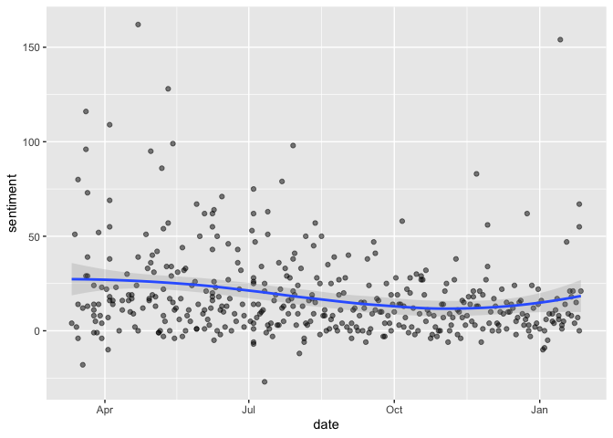
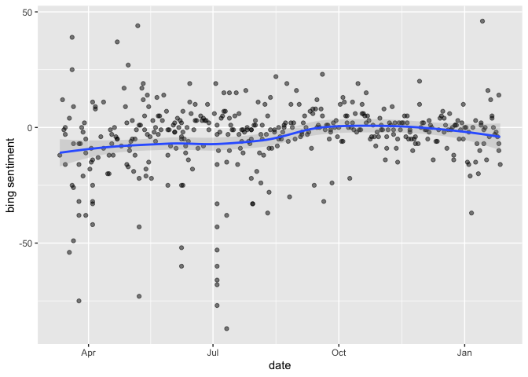
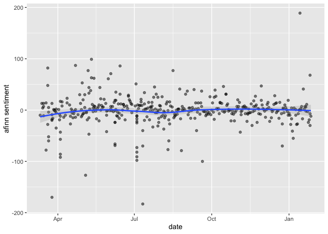
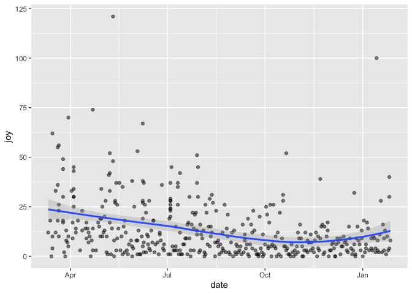
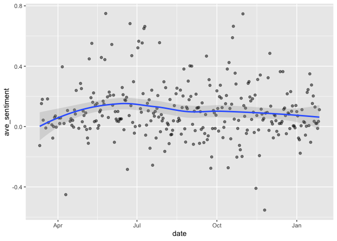
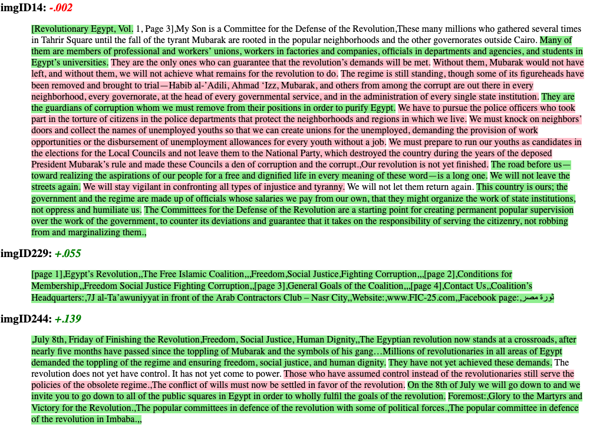
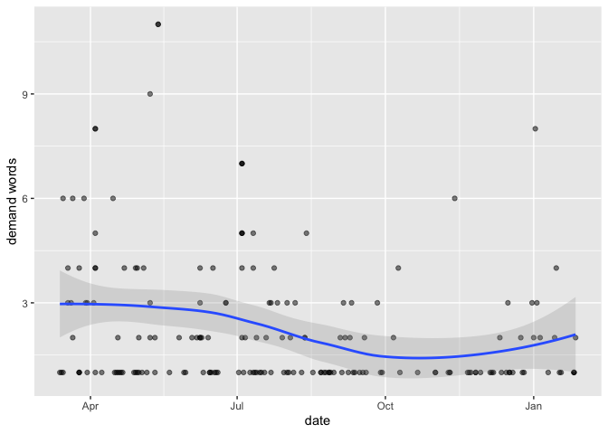
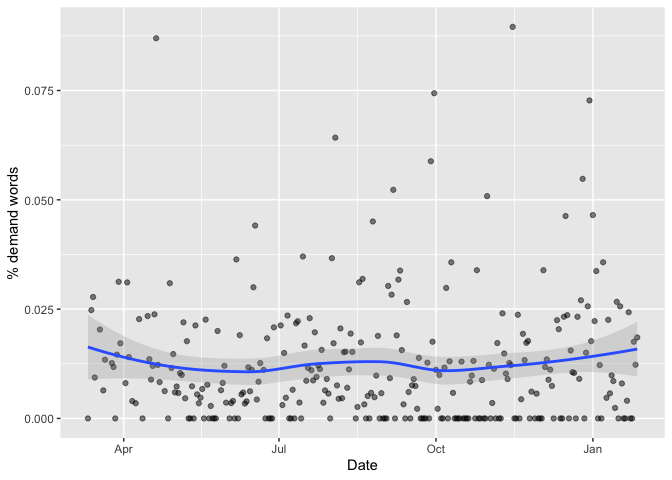

# Exercise 2: Sentiment analysis

## Introduction

In this tutorial, you will learn how to:

* Use dictionary-based techniques to analyze text
* Use common sentiment dictionaries
* Apply more advanced sentiment analysis techniques, e.g., accounting for "valence shifters."
* Create your own dictionary

## Setup 

The hands-on exercise for this week uses dictionary-based methods for filtering and scoring words. Dictionary-based methods use pre-generated lexicons, which are no more than list of words with associated scores or variables measuring the valence of a particular word. In this sense, the exercise is not unlike our analysis of Edinburgh Book Festival event descriptions. Here, we were filtering descriptions based on the presence or absence of a word related to women or gender. We can understand this approach as a particularly simple type of "dictionary-based" method. Here, our "dictionary" or "lexicon" contained just a few words related to gender. 

In this exercise we'll be using another new dataset. The data were sourced from a series of webpages on the Internet Archive that host material collected at the Arab Spring protests in Egypt in 2011. The original website can be seen [here](https://www.tahrirdocuments.org/) and below.

{width=100%}

For full details of the technique used to scrape these webpages, see [here](https://raw.githack.com/cjbarrie/RDL-Ed/main/03-screenscrape-apis/03-week7.html).

##  Load data and packages 

Before proceeding, we'll load the remaining packages we will need for this tutorial.


```r
library(tidyverse) # loads dplyr, ggplot2, and others
library(readr) # more informative and easy way to import data
library(stringr) # to handle text elements
library(tidytext) # includes set of functions useful for manipulating text
```

We can download the final dataset with:


```r
pamphdata <- read_csv("data/pamphlets_formatted_gsheets.csv")
```

```
## 
## ── Column specification ────────────────────────────────────────────────────────
## cols(
##   title = col_character(),
##   date = col_date(format = ""),
##   year = col_double(),
##   text = col_character(),
##   tags = col_character(),
##   imageurl = col_character(),
##   imgID = col_character(),
##   image = col_character()
## )
```

You can also view the formatted output of this scraping exercise, alongside images of the documents in question, in Google Sheets [here](https://docs.google.com/spreadsheets/d/1rg2VTV6uuknpu6u-L5n7kvQ2cQ6e6Js7IHp7CaSKe90/edit?usp=sharing).

If you're working on this document from your own computer ("locally") you can download the Tahrir documents data in the following way:


```r
pamphdata <- read_csv("https://raw.githubusercontent.com/cjbarrie/RDL-Ed/main/03-screenscrape-apis/data/pamphlets_formatted_gsheets.csv")
```

## Inspect and filter data 

Let's have a look at the data:


```r
head(pamphdata)
```

```
## # A tibble: 6 x 8
##   title      date        year text         tags      imageurl       imgID image 
##   <chr>      <date>     <dbl> <chr>        <chr>     <chr>          <chr> <chr> 
## 1 The Seaso… 2011-03-30  2011 The Season … Solidari… https://wayba… imgI… =Arra…
## 2 The Most … 2011-03-30  2011 [Voice of t… Solidari… https://wayba… imgI… <NA>  
## 3 Yes it’s … 2011-03-30  2011 [Voice of t… Solidari… https://wayba… imgI… <NA>  
## 4 The Revol… 2011-03-30  2011 [Voice of t… Revoluti… https://wayba… imgI… <NA>  
## 5 Voice of … 2011-03-30  2011 February 18… Revoluti… https://wayba… imgI… <NA>  
## 6 We Are St… 2011-03-29  2011 We Are Stil… Demands,… https://wayba… imgI… <NA>
```

Each document here is a pamphlet produced during the Arab Spring protests in Egypt in 2011. They have all been translated into English. The contents of each pamphlet are stored under the column entitled "text." This is the text with which we will be performing our analyses. Note also that each document has a particular date. We can therefore use these to look at any over time changes.

We manipulate the data into tidy format again, unnesting each token (here: words) from the pamphlet text. 


```r
tidy_pamph <- pamphdata %>% 
  mutate(desc = tolower(text)) %>%
  unnest_tokens(word, desc) %>%
  filter(str_detect(word, "[a-z]"))
```

We'll then tidy this further, as in the previous example, by removing stop words:


```r
tidy_pamph <- tidy_pamph %>%
    filter(!word %in% stop_words$word)
```

Then we can check what words we are left with that appear with most frequency in the cleaned data. We see that, as expected, we have lots of words relating to "revolution," "people," "demands" etc.:


```r
tidy_pamph %>%
  count(word, sort = TRUE)
```

```
## # A tibble: 12,133 x 2
##    word             n
##    <chr>        <int>
##  1 revolution    2051
##  2 people        1564
##  3 egypt         1073
##  4 egyptian      1049
##  5 al             905
##  6 regime         804
##  7 political      646
##  8 party          619
##  9 constitution   577
## 10 demands        575
## # … with 12,123 more rows
```

## Get sentiment dictionaries

Several sentiment dictionaries come bundled with the <tt>tidytext</tt> package. These are:

* `AFINN` from [Finn Årup Nielsen](http://www2.imm.dtu.dk/pubdb/views/publication_details.php?id=6010),
* `bing` from [Bing Liu and collaborators](https://www.cs.uic.edu/~liub/FBS/sentiment-analysis.html), and
* `nrc` from [Saif Mohammad and Peter Turney](http://saifmohammad.com/WebPages/NRC-Emotion-Lexicon.htm)

We can have a look at some of these to see how the relevant dictionaries are stored. 


```r
get_sentiments("afinn")
```

```
## # A tibble: 2,477 x 2
##    word       value
##    <chr>      <dbl>
##  1 abandon       -2
##  2 abandoned     -2
##  3 abandons      -2
##  4 abducted      -2
##  5 abduction     -2
##  6 abductions    -2
##  7 abhor         -3
##  8 abhorred      -3
##  9 abhorrent     -3
## 10 abhors        -3
## # … with 2,467 more rows
```


```r
get_sentiments("bing")
```

```
## # A tibble: 6,786 x 2
##    word        sentiment
##    <chr>       <chr>    
##  1 2-faces     negative 
##  2 abnormal    negative 
##  3 abolish     negative 
##  4 abominable  negative 
##  5 abominably  negative 
##  6 abominate   negative 
##  7 abomination negative 
##  8 abort       negative 
##  9 aborted     negative 
## 10 aborts      negative 
## # … with 6,776 more rows
```


```r
get_sentiments("nrc")
```

```
## # A tibble: 13,901 x 2
##    word        sentiment
##    <chr>       <chr>    
##  1 abacus      trust    
##  2 abandon     fear     
##  3 abandon     negative 
##  4 abandon     sadness  
##  5 abandoned   anger    
##  6 abandoned   fear     
##  7 abandoned   negative 
##  8 abandoned   sadness  
##  9 abandonment anger    
## 10 abandonment fear     
## # … with 13,891 more rows
```

What do we see here. First, the `AFINN` lexicon gives words a score from -5 to +5, where more negative scores indicate more negative sentiment and more positive scores indicate more positive sentiment.  The `nrc` lexicon opts for a binary classification: positive, negative, anger, anticipation, disgust, fear, joy, sadness, surprise, and trust, with each word given a score of 1/0 for each of these sentiments. In other words, for the `nrc` lexicon, words appear multiple times if they enclose more than one such emotion (see, e.g., "abandon" above). The `bing` lexicon is most minimal, classifying words simply into binary "positive" or "negative" categories. 

Let's see how we might filter the texts by selecting a dictionary, or subset of a dictionary, and using `inner_join()` to then filter out pamphlet data. We might, for example, be interested in joy words. Maybe, we might hypothesize, there is a uptick of joy toward the beginning of the revolutionary uprising, which then subsequently declined. First, let's have a look at the words in our pamphlet data that the `nrc` lexicon codes as joy-related words.


```r
nrc_joy <- get_sentiments("nrc") %>% 
  filter(sentiment == "joy")

tidy_pamph %>%
  inner_join(nrc_joy) %>%
  count(word, sort = TRUE)
```

```
## Joining, by = "word"
```

```
## # A tibble: 336 x 2
##    word         n
##    <chr>    <int>
##  1 freedom    447
##  2 god        381
##  3 youth      285
##  4 ministry   180
##  5 money      159
##  6 true       135
##  7 achieve    114
##  8 victory    106
##  9 majority   104
## 10 wealth     103
## # … with 326 more rows
```


We have a total of 336 words with some joy valence in our pamphlet data according to the `nrc` classification. Several seem reasonable (e.g., "freedom," "victory"); others seems less so (e.g., "god," "ministry").

## Sentiment trends over time

Do we see any time trends? First let's make sure the data are properly arranged in ascending order by date. We'll then add column, which we'll call "order," the use of which will become clear when we do the sentiment analysis.


```r
#order and format date
tidy_pamph<- tidy_pamph %>%
  arrange(date)

tidy_pamph$order <- 1:nrow(tidy_pamph)
```

Remember that the structure of our pamphlet data is in a one token (word) per document (pamphlet) format. In order to look at sentiment trends over time, we'll need to decide over how many words to estimate the sentiment. In the below, we first add in our sentiment diction with `inner_join()`. We then use the `count()` function, specifying that we want to count over dates, and that words should be indexed in order (i.e., by row number) over every 1000 rows (i.e., every 1000 words). This means that if one date has many documents totalling >1000 words, then we will have multiple observations for that given date; if there are only one or two documents then we might have just one row and associated sentiment score for that date. We then calculate the sentiment scores for each of our sentiment types (positive, negative, anger, anticipation, disgust, fear, joy, sadness, surprise, and trust) and use the `spread()` function to convert these into separate columns (rather than rows). Finally we calculate a net sentiment score by subtracting the score for negative sentiment from positive sentiment. 


```r
#get tweet sentiment by date
pamph_nrc_sentiment <- tidy_pamph %>%
  inner_join(get_sentiments("nrc")) %>%
  count(date, index = order %/% 1000, sentiment) %>%
  spread(sentiment, n, fill = 0) %>%
  mutate(sentiment = positive - negative)
```

```
## Joining, by = "word"
```

```r
pamph_nrc_sentiment %>%
  ggplot(aes(date, sentiment)) +
  geom_point(alpha=0.5) +
  geom_smooth(method= loess, alpha=0.25)
```

```
## `geom_smooth()` using formula 'y ~ x'
```

<!-- -->

How do our different sentiment dictionaries look when compared to each other? We can then plot the sentiment scores over time for each of our sentiment dictionaries like so:


```r
tidy_pamph %>%
  inner_join(get_sentiments("bing")) %>%
  count(date, index = order %/% 1000, sentiment) %>%
  spread(sentiment, n, fill = 0) %>%
  mutate(sentiment = positive - negative) %>%
  ggplot(aes(date, sentiment)) +
  geom_point(alpha=0.5) +
  geom_smooth(method= loess, alpha=0.25) +
  ylab("bing sentiment")
```

```
## Joining, by = "word"
```

```
## `geom_smooth()` using formula 'y ~ x'
```

<!-- -->

```r
tidy_pamph %>%
  inner_join(get_sentiments("nrc")) %>%
  count(date, index = order %/% 1000, sentiment) %>%
  spread(sentiment, n, fill = 0) %>%
  mutate(sentiment = positive - negative) %>%
  ggplot(aes(date, sentiment)) +
  geom_point(alpha=0.5) +
  geom_smooth(method= loess, alpha=0.25) +
  ylab("nrc sentiment")
```

```
## Joining, by = "word"
## `geom_smooth()` using formula 'y ~ x'
```

<!-- -->

```r
tidy_pamph %>%
  inner_join(get_sentiments("afinn")) %>%
  group_by(date, index = order %/% 1000) %>% 
  summarise(sentiment = sum(value)) %>% 
  ggplot(aes(date, sentiment)) +
  geom_point(alpha=0.5) +
  geom_smooth(method= loess, alpha=0.25) +
  ylab("afinn sentiment")
```

```
## Joining, by = "word"
```

```
## `summarise()` has grouped output by 'date'. You can override using the `.groups` argument.
```

```
## `geom_smooth()` using formula 'y ~ x'
```

<!-- -->

We see that they do look pretty similar... but they're not particularly informative beyond telling us there's no obvious time trend. We might therefore choose to focus our attention on one particular sentiment. As noted above, we might hypothesize that there was a greater frequency of joy sentiment earlier on in the uprising. We can check this by simply changing the sentiment variable we're analyzing in the `nrc` dictionary:


```r
tidy_pamph %>%
  inner_join(get_sentiments("nrc")) %>%
  count(date, index = order %/% 1000, sentiment) %>%
  spread(sentiment, n, fill = 0) %>%
  ggplot(aes(date, joy)) +
  geom_point(alpha=0.5) +
  geom_smooth(method= loess, alpha=0.25)
```

```
## Joining, by = "word"
```

```
## `geom_smooth()` using formula 'y ~ x'
```

<!-- -->

We do some small evidence that there was a higher frequency of joy words earlier on in the uprising. Further analyses, however, might build a more domain-specific dictionary. For example, if we were interested in the frequency of democracy demands over time, we might build a specific lexicon for this, coding democracy-related words as 1 and everything else as 0.

## Sentiment of sentences

Note that to this point we have been conducting sentiment analyses on unigrams; i.e., single words. Clearly this is prone to error. An obvious example of where such error could creep in is with negation. For example, in the sentence, "I am not happy" the word "happy" would be scored for positive emotion as the scoring method is blind to the negation. Negation is a type of "valence shifting." This means that the valence of a word might change depending on its broader context in a sequence of words. 

There are ways of dealing with this, however. In the next section we will look into how we might go about taking account of valence shifters. For this, we will be using   <tt>sentimentr</tt> package by @R-sentimentr. This is a development package so can't be installed in the normal way. Instead, run the following code to install it:


```r
if (!require("pacman")) install.packages("pacman")
pacman::p_load_current_gh("trinker/lexicon", "trinker/sentimentr")

library(sentimentr)
```


```r
library(sentimentr)

pamph_sentences <- get_sentences(pamphdata)
pamph_sentences_sent <- sentiment(pamph_sentences)

pamph_sentences_sent %>%
  group_by(date) %>%
  summarise(ave_sentiment = mean(sentiment)) %>%
  ggplot(aes(date, ave_sentiment)) +
  geom_point(alpha=0.5) +
  geom_smooth(method= loess, alpha=0.25)
```

```
## `geom_smooth()` using formula 'y ~ x'
```

<!-- -->

With the <tt>sentimentr</tt> package we can check how this dictionary-based method is scoring words by outputting random sections of text and highlighting them red or green based on the sentiment score attached to the sentence in question. This is easy to achieve with some in-built functions that come with the package: 


```r
set.seed(123)
pamphdata %>%
    filter(imgID %in% sample(unique(imgID), 3)) %>%
    mutate(pamphsentences = get_sentences(text)) %$%
    sentiment_by(pamphsentences, imgID) %>%
    highlight()
```


What do we make of how this text has been scored? There does seem to be some logic to the sections coded as positive versus negative. But more than anything, this shows us that there is clear error in how texts are scored, even when valence shifting is taken into account.

## Domain-specific lexicons

Of course, list- or dictionary-based methods need not only focus on sentiment, even if this is one of their most common uses. In essence, what you'll have seen from the above is that sentiment analysis techniques rely on a given lexicon and score words appropriately. And there is nothing stopping us from making our own dictionaries, whether they measure sentiment or not. In the data above, we might be interested, for example, in the demands individuals or organizations are advancing at protests. As such, we might choose to make our own dictionary of terms. What would this look like?

A very minimal example would choose, for example, words like "demand" and its synonyms and score these all as 1. We would then combine these into a dictionary, which we've called "demdict" here. 


```r
word <- c('demand', 'claim', 'call', 'insist')
value <- c(1, 1, 1, 1)
demdict <- data.frame(word, value)

demdict
```

```
##     word value
## 1 demand     1
## 2  claim     1
## 3   call     1
## 4 insist     1
```

We could then use the same technique as above to bind these with our data and look at the incidence of such words over time. Combining the sequence of scripts from above we would do the following:


```r
#get tidy version of pamphlet data
tidy_pamph <- pamphdata %>% 
  mutate(desc = tolower(text)) %>%
  unnest_tokens(word, desc) %>%
  filter(str_detect(word, "[a-z]"))

#remove stopwords
tidy_pamph <- tidy_pamph %>%
    filter(!word %in% stop_words$word)

#order and format date
tidy_pamph<- tidy_pamph %>%
  arrange(date)
#get indexing column
tidy_pamph$order <- 1:nrow(tidy_pamph)

tidy_pamph %>%
  inner_join(demdict) %>%
  group_by(date, index = order %/% 1000) %>% 
  summarise(demandwords = sum(value)) %>% 
  ggplot(aes(date, demandwords)) +
  geom_point(alpha=0.5) +
  geom_smooth(method= loess, alpha=0.25) +
  ylab("demand words")
```

```
## Joining, by = "word"
```

```
## `summarise()` has grouped output by 'date'. You can override using the `.groups` argument.
```

```
## `geom_smooth()` using formula 'y ~ x'
```

<!-- -->

The above simply counts the number of demand words over time. This might be misleading if there are, for example, more or longer documents at certain points in time; i.e., if the length or quantity of text is not time-constant. Why would this matter? Well, in the above it could just be that we have more demand words earlier on because there are just more pamphlets earlier on. By just counting words, we are not taking into account the denominator.


An alternative, and preferable, method here would simply take a character string of the relevant words. We would then sum the total number of words across all pamphlets over time. Then we would filter our pamphlet words by whether or not they are a demand word or not, according to the dictionary of words we have constructed. We would then do the same again with these words, summing the number of times they appear for each data. 

After this, we join with our data frame of total words for each data. Note that here we are using `full_join()` as we want to include dates that appear in the "totals" data frame that do not appear when we filter for demand words; i.e., days when demand words are equal to 0. We then go about plotting as before.


```r
demwords <- c('demand', 'claim', 'call', 'insist')

#get total tweets per day (no missing dates so no date completion required)
totals <- tidy_pamph %>%
  mutate(obs=1) %>%
  group_by(date) %>%
  summarise(sum_words = sum(obs))

#plot
tidy_pamph %>%
  mutate(obs=1) %>%
  filter(grepl(paste0(demwords, collapse = "|"),word, ignore.case = T)) %>%
  group_by(date) %>%
  summarise(sum_dwords = sum(obs)) %>%
  full_join(totals, word, by="date") %>%
  mutate(sum_dwords= ifelse(is.na(sum_dwords), 0, sum_dwords),
         pctdwords = sum_dwords/sum_words) %>%
  ggplot(aes(date, pctdwords)) +
  geom_point(alpha=0.5) +
  geom_smooth(method= loess, alpha=0.25) +
  xlab("Date") + ylab("% demand words")
```

```
## `geom_smooth()` using formula 'y ~ x'
```

<!-- -->

## Exercises

1. Take a subset of the pamphlets data by "tag." These tags describe the content of the pamphlet. Do we see different sentiment dynamics if we look only at a subset of these documents?
2. Build your own (minimal) dictionary-based filter technique and plot the result

## References 
