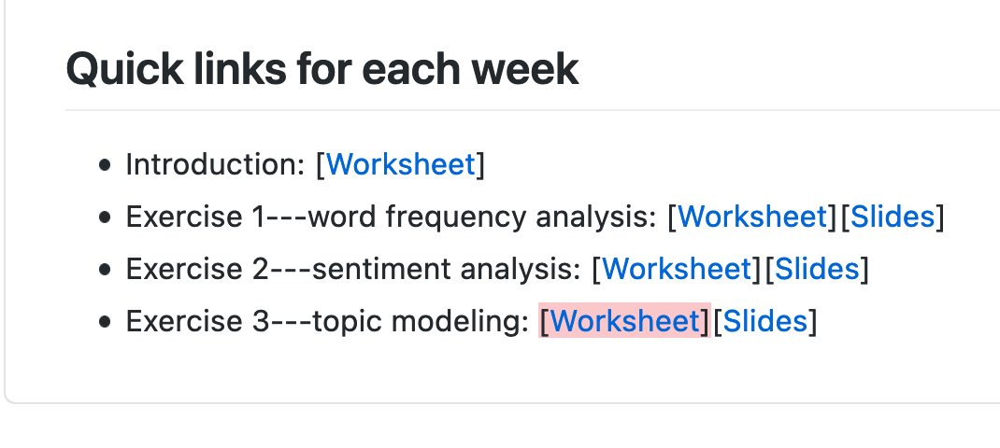

Topic models
========================================================
author: Christopher Barrie 
date: University of Edinburgh
width: 2500
height: 900
transition: none  
  website: https://cjbarrie.xyz     
  github: https://github.com/cjbarrie       
  Twitter: https://www.twitter.com/cbarrie

Topic models
========================================================

- Form of unsupervised learning
    - Identifies *k* topics from bag of words across documents
        - Assumes each document is generated from a set of *k* topics
        - Assumes each word has probability *p* of belonging to a certain topic
    - We observe only words and documents
    - We specify k of topics
    
Topic models
========================================================

- Why use it?
    - Classification (when k of topics "known")
    - Exploratory analysis
        - "Reverse engineering" the topic generation process
        - N.B. Tea leaves problem
        
========================================================

<center>

</center>

========================================================

<center>

</center>
- Source: Nelson, Laura K. 2020. "Computational Grounded Theory: A Methodological Framework," *Sociological Methods & Research*, 49(1) 3-42.

========================================================

<center>

</center>

========================================================

<center>

</center>
- Source: Smith et al. 2021. "Automatic detection of influential actors in disinformation networks," *Proceedings of the National Academy of Sciences*, 118(4) 1-10.

    
Topic models
========================================================


- Data structure:
    - `DocumentTermMatrix`
    

```
<<DocumentTermMatrix (documents: 2, terms: 12092)>>
Non-/sparse entries: 17581/6603
Sparsity           : 27%
Maximal term length: 18
Weighting          : term frequency (tf)
Sample             :
      Terms
Docs   country democratic government laws nations people power society time
  DiA1     357        212        556  397     233    516   543     290  311
  DiA2     167        561        162  133     313    360   263     241  309
      Terms
Docs   united
  DiA1    554
  DiA2    227
```


Getting the data
========================================================


```r
library(tidyverse) # loads dplyr, ggplot2, and others
library(stringr) # to handle text elements
library(tidytext) # includes set of functions useful for manipulating text
library(topicmodels) # to estimate topic models
library(gutenbergr) # to get text data
library(scales)
library(tm)
library(ggthemes) # to make your plots look nice
```


```r
tocq <- gutenberg_download(c(815, 816), 
                            meta_fields = "author")
```


Converting to DocumentTermMatrix
========================================================


```r
tocq_words <- tocq %>%
  mutate(booknumber = ifelse(gutenberg_id==815, "DiA1", "DiA2")) %>%
  unnest_tokens(word, text) %>%
  count(booknumber, word, sort = TRUE) %>%
  ungroup() %>%
  anti_join(stop_words)

tocq_dtm <- tocq_words %>%
  cast_dtm(booknumber, word, n)

tm::inspect(tocq_dtm)
```

```
<<DocumentTermMatrix (documents: 2, terms: 12092)>>
Non-/sparse entries: 17581/6603
Sparsity           : 27%
Maximal term length: 18
Weighting          : term frequency (tf)
Sample             :
      Terms
Docs   country democratic government laws nations people power society time united
  DiA1     357        212        556  397     233    516   543     290  311    554
  DiA2     167        561        162  133     313    360   263     241  309    227
```

Estimating a topic model
========================================================


```r
tocq_lda <- LDA(tocq_dtm, k = 10, control = list(seed = 1234))
```

Evaluating a topic model
========================================================

- β: per-topic-per-word probabilities
    - i.e., the probability that the given term belongs to a given topic


```r
tocq_topics <- tidy(tocq_lda, matrix = "beta")
head(tocq_topics, n = 10)
```

```
# A tibble: 10 x 3
   topic term          beta
   <int> <chr>        <dbl>
 1     1 democratic 0.00855
 2     2 democratic 0.0115 
 3     3 democratic 0.00444
 4     4 democratic 0.0193 
 5     5 democratic 0.00254
 6     6 democratic 0.00866
 7     7 democratic 0.00165
 8     8 democratic 0.0108 
 9     9 democratic 0.00276
10    10 democratic 0.00334
```

Evaluating a topic model
========================================================

- γ: per-document-per-topic probabilities
    - i.e., the probability that a given document (here: Volume) belongs to a particular topic
    

```r
tocq_gamma <- tidy(tocq_lda, matrix = "gamma")
head(tocq_gamma, n = 10)
```

```
# A tibble: 10 x 3
   document topic      gamma
   <chr>    <int>      <dbl>
 1 DiA2         1 0.00504   
 2 DiA1         1 0.0217    
 3 DiA2         2 0.198     
 4 DiA1         2 0.00000152
 5 DiA2         3 0.00000213
 6 DiA1         3 0.197     
 7 DiA2         4 0.216     
 8 DiA1         4 0.00000152
 9 DiA2         5 0.180     
10 DiA1         5 0.00000152
```

Extensions
========================================================

- "Structural topic models": from [Roberts et al.](https://scholar.princeton.edu/files/bstewart/files/stmnips2013.pdf) and dedicated webpage [here](https://www.structuraltopicmodel.com/)
- Stochastic block model approches: see [Gerlach et al.](https://advances.sciencemag.org/content/4/7/eaaq1360/) and Github repo [here](https://github.com/martingerlach/hSBM_Topicmodel)

Worksheet
========================================================

- [https://github.com/cjbarrie/CTA-Ed](https://github.com/cjbarrie/CTA-Ed)

<center>

</center>
