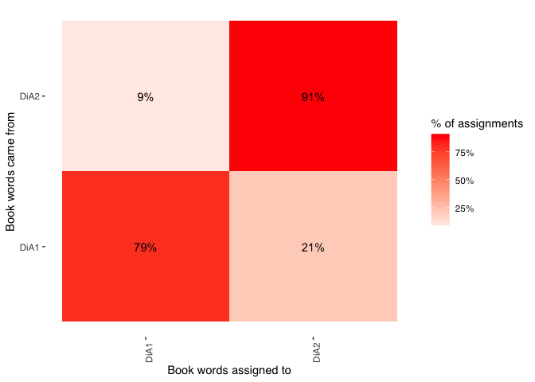

# Exercise 3: Topic models

## Introduction

In this tutorial, you will learn how to:

* Convert to and from tidy format
* Estimate a topic model
* Evaluate the output

## Setup 


```r
library(tidyverse) # loads dplyr, ggplot2, and others
library(stringr) # to handle text elements
library(tidytext) # includes set of functions useful for manipulating text
library(topicmodels) # to estimate topic models
library(gutenbergr) # to get text data
library(scales)
library(tm)
library(ggthemes) # to make your plots look nice
```

We'll be using data from Alexis de Tocqueville's "Democracy in America." We will download these data , both Volume 1 and Volume 2, and combine them into one data frame. For this, we'll be using the <tt>gutenbergr</tt> package, which allows the user to download text data from over 60,000 out-of-copyright books. The ID for each book appears in the url for the book selected after a search on [https://www.gutenberg.org/ebooks/](https://www.gutenberg.org/ebooks/).

{width=100%}

Here, we see that Volume of Tocqueville's "Democracy in America" is stored as "815". A separate search reveals that Volume 2 is stored as "816".


```r
tocq <- gutenberg_download(c(815, 816), 
                            meta_fields = "author")
```


## Convert to document-term-matrix

Once we have read in these data, we convert it into a different data shape: the document-term-matrix. We also create a new columns, which we call "booknumber" that recordss whether the term in question is from Volume 1 or Volume 2. To convert from tidy into "DocumentTermMatrix" format we can first use `unnest_tokens()` as we have done in past exercises, remove stop words, and then use the `cast_dtm()` function to convert into a "DocumentTermMatrix" object.


```r
tocq_words <- tocq %>%
  mutate(booknumber = ifelse(gutenberg_id==815, "DiA1", "DiA2")) %>%
  unnest_tokens(word, text) %>%
  count(booknumber, word, sort = TRUE) %>%
  ungroup() %>%
  anti_join(stop_words)
```

```
## Joining, by = "word"
```

```r
tocq_dtm <- tocq_words %>%
  cast_dtm(booknumber, word, n)

tm::inspect(tocq_dtm)
```

```
## <<DocumentTermMatrix (documents: 2, terms: 12092)>>
## Non-/sparse entries: 17581/6603
## Sparsity           : 27%
## Maximal term length: 18
## Weighting          : term frequency (tf)
## Sample             :
##       Terms
## Docs   country democratic government laws nations people power society time
##   DiA1     357        212        556  397     233    516   543     290  311
##   DiA2     167        561        162  133     313    360   263     241  309
##       Terms
## Docs   united
##   DiA1    554
##   DiA2    227
```

We see here that the data are now stored as a "DocumentTermMatrix." In this format, the matrix records the term (as equivalent of a column) and the document (as equivalent of row), and the number of times the term appears in the given document. Many terms will not appear in the document, meaning that the matrix will be stored as "sparse," meaning there will be a preponderance of zeroes. Here, since we are looking only at two documents that both come from a single volume set, the sparsity is relatively low (only 27%). In most applications, the sparsity will be a lot higher, approaching 99% or more.

Estimating our topic model is then relatively simple. All we need to do if specify how many topics that we want to search for, and we can also set our seed, which is needed to reproduce the same results each time (as the model is a generative probabilistic one, meaning different random iterations will produce different results).


```r
tocq_lda <- LDA(tocq_dtm, k = 10, control = list(seed = 1234))
```

After this we can extract the per-topic-per-word probabilities, called "β" from the model:


```r
tocq_topics <- tidy(tocq_lda, matrix = "beta")

head(tocq_topics, n = 10)
```

```
## # A tibble: 10 x 3
##    topic term          beta
##    <int> <chr>        <dbl>
##  1     1 democratic 0.00855
##  2     2 democratic 0.0115 
##  3     3 democratic 0.00444
##  4     4 democratic 0.0193 
##  5     5 democratic 0.00254
##  6     6 democratic 0.00866
##  7     7 democratic 0.00165
##  8     8 democratic 0.0108 
##  9     9 democratic 0.00276
## 10    10 democratic 0.00334
```

We now have data stored as one topic-per-term-per-row. The betas listed here represent the probability that the given term belongs to a given topic. So, here, we see that the term "democratic" is most likely to belong to topic 4. Strictly, this probability represents the probability that the term is generated from the topic in question.

We can then plots the top terms, in terms of beta, for each topic as follows:


```r
tocq_top_terms <- tocq_topics %>%
  group_by(topic) %>%
  top_n(10, beta) %>%
  ungroup() %>%
  arrange(topic, -beta)

tocq_top_terms %>%
  mutate(term = reorder_within(term, beta, topic)) %>%
  ggplot(aes(beta, term, fill = factor(topic))) +
  geom_col(show.legend = FALSE) +
  facet_wrap(~ topic, scales = "free", ncol = 4) +
  scale_y_reordered() +
  theme_tufte(base_family = "Helvetica")
```

<!-- -->

But how do we actually evaluate these topics? Here, the topics all seem pretty similar. 

## Evaluating topic model

Well, one way to evaluate the performance of unspervised forms of classification is by testing our model on an outcome that is already known. 

Here, two topics that are most obvious are the 'topics' Volume 1 and Volume 2 of Tocqueville's "Democracy in America." Volume 1 of Tocqueville's work deals more obviously with abstract constitutional ideas and questions of race; Volume 2 focuses on more esoteric aspects of American society. Listen an "In Our Time" episode with Melvyn Bragg discussing Democracy in America [here](https://www.bbc.co.uk/programmes/b09vyw0x).

Given these differences in focus, we might think that a generative model could accurately assign to topic (i.e., Volume) with some accuracy.

### Plot relative word frequencies

First let's have a look and see whether there really are words obviously distinguishing the two Volumes. 


```r
tidy_tocq <- tocq %>%
  unnest_tokens(word, text) %>%
  anti_join(stop_words)
```

```
## Joining, by = "word"
```

```r
## Count most common words in both
tidy_tocq %>%
  count(word, sort = TRUE)
```

```
## # A tibble: 12,092 x 2
##    word           n
##    <chr>      <int>
##  1 people       876
##  2 power        806
##  3 united       781
##  4 democratic   773
##  5 government   718
##  6 time         620
##  7 nations      546
##  8 society      531
##  9 laws         530
## 10 country      524
## # … with 12,082 more rows
```

```r
bookfreq <- tidy_tocq %>%
  mutate(booknumber = ifelse(gutenberg_id==815, "DiA1", "DiA2")) %>%
  mutate(word = str_extract(word, "[a-z']+")) %>%
  count(booknumber, word) %>%
  group_by(booknumber) %>%
  mutate(proportion = n / sum(n)) %>% 
  select(-n) %>% 
  spread(booknumber, proportion)

ggplot(bookfreq, aes(x = DiA1, y = DiA2, color = abs(DiA1 - DiA2))) +
  geom_abline(color = "gray40", lty = 2) +
  geom_jitter(alpha = 0.1, size = 2.5, width = 0.3, height = 0.3) +
  geom_text(aes(label = word), check_overlap = TRUE, vjust = 1.5) +
  scale_x_log10(labels = percent_format()) +
  scale_y_log10(labels = percent_format()) +
  scale_color_gradient(limits = c(0, 0.001), low = "darkslategray4", high = "gray75") +
  theme_tufte(base_family = "Helvetica") +
  theme(legend.position="none", 
        strip.background = element_blank(), 
        strip.text.x = element_blank()) +
  labs(x = "Tocqueville DiA 2", y = "Tocqueville DiA 1") +
  coord_equal()
```

```
## Warning: Removed 6173 rows containing missing values (geom_point).
```

```
## Warning: Removed 6174 rows containing missing values (geom_text).
```

<!-- -->

We see that there do seem to be some marked distinguishing characteristics. In the plot above, for example, we see that more abstract notions of state systems appear with greater frequency in Volume 1 while Volume 2 seems to contain words specific to America (e.g., "north" and "south") with greater frequency. The way to read the above plot is that words positioned further away from the diagonal line appear with greater frequency in one volume versus the other.


### Split into chapter documents

In the below, we first separate the volumes into chapters, then we repeat the same procedure as above. The only difference now is that instead of two documents representing the two full volumes of Tocqueville's work, we now have 132 documents, each representing an individual chapter. Notice now that the sparsity is much increased: around 96%. 


```r
# Divide into documents, each representing one chapter
tocq_chapter <- tocq %>%
  mutate(booknumber = ifelse(gutenberg_id==815, "DiA1", "DiA2")) %>%
  group_by(booknumber) %>%
  mutate(chapter = cumsum(str_detect(text, regex("^chapter ", ignore_case = TRUE)))) %>%
  ungroup() %>%
  filter(chapter > 0) %>%
  unite(document, booknumber, chapter)

# Split into words
tocq_chapter_word <- tocq_chapter %>%
  unnest_tokens(word, text)

# Find document-word counts
tocq_word_counts <- tocq_chapter_word %>%
  anti_join(stop_words) %>%
  count(document, word, sort = TRUE) %>%
  ungroup()
```

```
## Joining, by = "word"
```

```r
tocq_word_counts
```

```
## # A tibble: 69,781 x 3
##    document word             n
##    <chr>    <chr>        <int>
##  1 DiA2_76  united          88
##  2 DiA2_60  honor           70
##  3 DiA1_52  union           66
##  4 DiA2_76  president       60
##  5 DiA2_76  law             59
##  6 DiA1_42  jury            57
##  7 DiA2_76  time            50
##  8 DiA1_11  township        49
##  9 DiA1_21  federal         48
## 10 DiA2_76  constitution    48
## # … with 69,771 more rows
```

```r
# Cast into DTM format for LDA analysis

tocq_chapters_dtm <- tocq_word_counts %>%
  cast_dtm(document, word, n)

tm::inspect(tocq_chapters_dtm)
```

```
## <<DocumentTermMatrix (documents: 132, terms: 11898)>>
## Non-/sparse entries: 69781/1500755
## Sparsity           : 96%
## Maximal term length: 18
## Weighting          : term frequency (tf)
## Sample             :
##          Terms
## Docs      country democratic government laws nations people power public time
##   DiA1_11      10          0         23   19       7     13    19     15    6
##   DiA1_13      13          5         34    9      12     17    37     15    6
##   DiA1_20       9          0         25   13       2     14    32     13   10
##   DiA1_21       4          0         20   29       6     12    20      5    5
##   DiA1_23      10          0         35    9      24     20    13      4    8
##   DiA1_31       7         12         10   13       4     30    18     31    6
##   DiA1_32      10         14         25    6       9     25    11     43    8
##   DiA1_47      12          2          5    3       3      6     8      0    3
##   DiA1_56      12          0          3    7      19      3     8      3   22
##   DiA2_76      11         10         24   39      12     31    27     27   50
##          Terms
## Docs      united
##   DiA1_11     13
##   DiA1_13     19
##   DiA1_20     21
##   DiA1_21     23
##   DiA1_23     15
##   DiA1_31     11
##   DiA1_32     14
##   DiA1_47      8
##   DiA1_56     25
##   DiA2_76     88
```

We then re-estimate the topic model with this new DocumentTermMatrix object, specifying k equal to 2. This will enable us to evaluate whether a topic model is able to generatively assign to volume with accuracy.


```r
tocq_chapters_lda <- LDA(tocq_chapters_dtm, k = 2, control = list(seed = 1234))
```

After this, it is worth looking at another output of the latent dirichlet allocation procedure. The γ probability represents the per-document-per-topic probability or, in other words, the probability that a given document (here: chapter) belongs to a particular topic (and here, we are assuming these topics represent volumes).

The gamma values are therefore the estimated proportion of words within a given chapter allocated to a given volume. 


```r
tocq_chapters_gamma <- tidy(tocq_chapters_lda, matrix = "gamma")
tocq_chapters_gamma
```

```
## # A tibble: 264 x 3
##    document topic     gamma
##    <chr>    <int>     <dbl>
##  1 DiA2_76      1 0.551    
##  2 DiA2_60      1 1.00     
##  3 DiA1_52      1 0.0000464
##  4 DiA1_42      1 0.0000746
##  5 DiA1_11      1 0.0000382
##  6 DiA1_21      1 0.0000437
##  7 DiA1_20      1 0.0000425
##  8 DiA1_28      1 0.249    
##  9 DiA1_50      1 0.0000477
## 10 DiA1_22      1 0.0000466
## # … with 254 more rows
```

### Examine consensus

Now that we have these topic probabilities, we can see how well our unsupervised learning did at distinguishing the two volumes generatively just from the words contained in each chapter.


```r
# First separate the document name into title and chapter

tocq_chapters_gamma <- tocq_chapters_gamma %>%
  separate(document, c("title", "chapter"), sep = "_", convert = TRUE)

tocq_chapter_classifications <- tocq_chapters_gamma %>%
  group_by(title, chapter) %>%
  top_n(1, gamma) %>%
  ungroup()

tocq_book_topics <- tocq_chapter_classifications %>%
  count(title, topic) %>%
  group_by(title) %>%
  top_n(1, n) %>%
  ungroup() %>%
  transmute(consensus = title, topic)

tocq_chapter_classifications %>%
  inner_join(tocq_book_topics, by = "topic") %>%
  filter(title != consensus)
```

```
## # A tibble: 15 x 5
##    title chapter topic gamma consensus
##    <chr>   <int> <int> <dbl> <chr>    
##  1 DiA1       45     1 0.762 DiA2     
##  2 DiA1        5     1 0.504 DiA2     
##  3 DiA1       33     1 0.570 DiA2     
##  4 DiA1       34     1 0.626 DiA2     
##  5 DiA1       41     1 0.512 DiA2     
##  6 DiA1       44     1 0.765 DiA2     
##  7 DiA1        8     1 0.791 DiA2     
##  8 DiA1        4     1 0.717 DiA2     
##  9 DiA1       35     1 0.576 DiA2     
## 10 DiA1       39     1 0.577 DiA2     
## 11 DiA1        7     1 0.687 DiA2     
## 12 DiA1       29     1 0.983 DiA2     
## 13 DiA1        6     1 0.707 DiA2     
## 14 DiA2       27     2 0.654 DiA1     
## 15 DiA2       21     2 0.510 DiA1
```

```r
# Look document-word pairs were to see which words in each documents were assigned
# to a given topic

assignments <- augment(tocq_chapters_lda, data = tocq_chapters_dtm)
assignments
```

```
## # A tibble: 69,781 x 4
##    document term   count .topic
##    <chr>    <chr>  <dbl>  <dbl>
##  1 DiA2_76  united    88      2
##  2 DiA2_60  united     6      1
##  3 DiA1_52  united    11      2
##  4 DiA1_42  united     7      2
##  5 DiA1_11  united    13      2
##  6 DiA1_21  united    23      2
##  7 DiA1_20  united    21      2
##  8 DiA1_28  united    14      2
##  9 DiA1_50  united     5      2
## 10 DiA1_22  united     8      2
## # … with 69,771 more rows
```

```r
assignments <- assignments %>%
  separate(document, c("title", "chapter"), sep = "_", convert = TRUE) %>%
  inner_join(tocq_book_topics, by = c(".topic" = "topic"))

assignments %>%
  count(title, consensus, wt = count) %>%
  group_by(title) %>%
  mutate(percent = n / sum(n)) %>%
  ggplot(aes(consensus, title, fill = percent)) +
  geom_tile() +
  scale_fill_gradient2(high = "red", label = percent_format()) +
  geom_text(aes(x = consensus, y = title, label = scales::percent(percent))) +
  theme_tufte(base_family = "Helvetica") +
  theme(axis.text.x = element_text(angle = 90, hjust = 1),
        panel.grid = element_blank()) +
  labs(x = "Book words assigned to",
       y = "Book words came from",
       fill = "% of assignments")
```

<!-- -->

Not bad! We see that the model estimated with accuracy 91% of chapters in Volume 2 and 79% of chapters in Volume 1

## Exercises

1. Choose another book or set of books from Project Gutenberg
2. Run your own topic model on these books, changing the k of topics, and evaluating accuracy.

## References 
