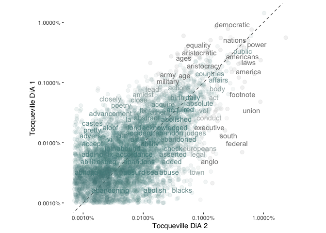

# Exercise 3: Topic models

## Introduction

In this tutorial, you will learn how to:

* Convert to and from tidy format
* Estimate a topic model
* Evaluate the output

## Setup 


```r
library(tidyverse) # loads dplyr, ggplot2, and others
library(stringr) # to handle text elements
library(tidytext) # includes set of functions useful for manipulating text
library(topicmodels) # to estimate topic models
library(gutenbergr) # to get text data
library(scales)
library(tm)
library(ggthemes) # to make your plots look nice
```

We'll be using data from Alexis de Tocqueville's "Democracy in America." We will download these data as a whole and separated into Parts 1 and 2. For this, we'll be using the <tt>gutenbergr</tt> package, which allows the user to download text data from over 60,000 out-of-copyright books. The ID for each book appears in the url for the book selected after a search on [https://www.gutenberg.org/ebooks/](https://www.gutenberg.org/ebooks/).

{width=100%}
Here, we see that Volume of Tocqueville's "Democracy in America" is stored as "815", while Volume 2 is stored as "816".


```r
tocq <- gutenberg_download(c(815, 816), 
                            meta_fields = "author")

tocq1 <- gutenberg_download(c(815), 
                              meta_fields = "author")

tocq2 <- gutenberg_download(c(816), 
                            meta_fields = "author")
```


```r
tidy_tocq <- tocq %>%
  unnest_tokens(word, text) %>%
  anti_join(stop_words)
```

```
## Joining, by = "word"
```

```r
## Count most common words in both
tidy_tocq %>%
  count(word, sort = TRUE)
```

```
## # A tibble: 12,092 x 2
##    word           n
##    <chr>      <int>
##  1 people       876
##  2 power        806
##  3 united       781
##  4 democratic   773
##  5 government   718
##  6 time         620
##  7 nations      546
##  8 society      531
##  9 laws         530
## 10 country      524
## # … with 12,082 more rows
```

```r
bookfreq <- tidy_tocq %>%
  mutate(booknumber = ifelse(gutenberg_id==815, "DiA1", "DiA2")) %>%
  mutate(word = str_extract(word, "[a-z']+")) %>%
  count(booknumber, word) %>%
  group_by(booknumber) %>%
  mutate(proportion = n / sum(n)) %>% 
  select(-n) %>% 
  spread(booknumber, proportion)

ggplot(bookfreq, aes(x = DiA1, y = DiA2, color = abs(DiA1 - DiA2))) +
  geom_abline(color = "gray40", lty = 2) +
  geom_jitter(alpha = 0.1, size = 2.5, width = 0.3, height = 0.3) +
  geom_text(aes(label = word), check_overlap = TRUE, vjust = 1.5) +
  scale_x_log10(labels = percent_format()) +
  scale_y_log10(labels = percent_format()) +
  scale_color_gradient(limits = c(0, 0.001), low = "darkslategray4", high = "gray75") +
  theme_tufte(base_family = "Helvetica") +
  theme(legend.position="none", 
        strip.background = element_blank(), 
        strip.text.x = element_blank()) +
  labs(x = "Tocqueville DiA 2", y = "Tocqueville DiA 1") +
  coord_equal()
```

```
## Warning: Removed 6173 rows containing missing values (geom_point).
```

```
## Warning: Removed 6174 rows containing missing values (geom_text).
```

<!-- -->

## Convert to document-term-matrix


```r
tocq_words <- tocq %>%
  mutate(booknumber = ifelse(gutenberg_id==815, "DiA1", "DiA2")) %>%
  unnest_tokens(word, text) %>%
  count(booknumber, word, sort = TRUE) %>%
  ungroup() %>%
  anti_join(stop_words)
```

```
## Joining, by = "word"
```

```r
tocq_dtm <- tocq_words %>%
  cast_dtm(booknumber, word, n)

tm::inspect(tocq_dtm)
```

```
## <<DocumentTermMatrix (documents: 2, terms: 12092)>>
## Non-/sparse entries: 17581/6603
## Sparsity           : 27%
## Maximal term length: 18
## Weighting          : term frequency (tf)
## Sample             :
##       Terms
## Docs   country democratic government laws nations people power society time
##   DiA1     357        212        556  397     233    516   543     290  311
##   DiA2     167        561        162  133     313    360   263     241  309
##       Terms
## Docs   united
##   DiA1    554
##   DiA2    227
```


```r
tocq_lda <- LDA(tocq_dtm, k = 2, control = list(seed = 1234))
#  Extract the per-topic-per-word probabilities, called "β" from the model.
tocq_topics <- tidy(tocq_lda, matrix = "beta")
tocq_topics
```

```
## # A tibble: 24,184 x 3
##    topic term          beta
##    <int> <chr>        <dbl>
##  1     1 democratic 0.00674
##  2     2 democratic 0.00606
##  3     1 government 0.00660
##  4     2 government 0.00524
##  5     1 united     0.00936
##  6     2 united     0.00321
##  7     1 power      0.00614
##  8     2 power      0.00733
##  9     1 people     0.0107 
## 10     2 people     0.00335
## # … with 24,174 more rows
```


```r
# Notice that this has turned the model into a one-topic-per-term-per-row 
# format. For each combination, the model computes the probability of that 
# term being generated from that topic. For example, the term “democratic” has a  
# 0.00674 probability of being generated from topic 1, but a 0.00606 probability
# of being generated from topic 2.

tocq_top_terms <- tocq_topics %>%
  group_by(topic) %>%
  top_n(10, beta) %>%
  ungroup() %>%
  arrange(topic, -beta)

head(tocq_top_terms)
```

```
## # A tibble: 6 x 3
##   topic term          beta
##   <int> <chr>        <dbl>
## 1     1 people     0.0107 
## 2     1 united     0.00936
## 3     1 democratic 0.00674
## 4     1 government 0.00660
## 5     1 americans  0.00659
## 6     1 country    0.00640
```


```r
## Topic modelling example by chapters (to give more individual documents)

# Divide into documents, each representing one chapter
tocq_chapter <- tocq %>%
  mutate(booknumber = ifelse(gutenberg_id==815, "DiA1", "DiA2")) %>%
  group_by(booknumber) %>%
  mutate(chapter = cumsum(str_detect(text, regex("^chapter ", ignore_case = TRUE)))) %>%
  ungroup() %>%
  filter(chapter > 0) %>%
  unite(document, booknumber, chapter)

# Split into words
tocq_chapter_word <- tocq_chapter %>%
  unnest_tokens(word, text)

# Find document-word counts
tocq_word_counts <- tocq_chapter_word %>%
  anti_join(stop_words) %>%
  count(document, word, sort = TRUE) %>%
  ungroup()
```

```
## Joining, by = "word"
```

```r
tocq_word_counts
```

```
## # A tibble: 69,781 x 3
##    document word             n
##    <chr>    <chr>        <int>
##  1 DiA2_76  united          88
##  2 DiA2_60  honor           70
##  3 DiA1_52  union           66
##  4 DiA2_76  president       60
##  5 DiA2_76  law             59
##  6 DiA1_42  jury            57
##  7 DiA2_76  time            50
##  8 DiA1_11  township        49
##  9 DiA1_21  federal         48
## 10 DiA2_76  constitution    48
## # … with 69,771 more rows
```

```r
# Cast into DTM format for LDA analysis

tocq_chapters_dtm <- tocq_word_counts %>%
  cast_dtm(document, word, n)

# Look for 2 topics across all chapters 
# (one would assume these correspond to vols. 1 and 2)
tocq_chapters_lda <- LDA(tocq_chapters_dtm, k = 2, control = list(seed = 1234))

# Examine per-topic-per-word probabilities
tocq_chapter_topics <- tidy(tocq_chapters_lda, matrix = "beta")
tocq_chapter_topics
```

```
## # A tibble: 23,796 x 3
##    topic term           beta
##    <int> <chr>         <dbl>
##  1     1 united    0.00401  
##  2     2 united    0.00916  
##  3     1 honor     0.00169  
##  4     2 honor     0.000203 
##  5     1 union     0.0000296
##  6     2 union     0.00791  
##  7     1 president 0.0000757
##  8     2 president 0.00274  
##  9     1 law       0.00168  
## 10     2 law       0.00427  
## # … with 23,786 more rows
```

```r
# Find top 5 terms within each topic

tocq_top_terms <- tocq_chapter_topics %>%
  group_by(topic) %>%
  top_n(5, beta) %>%
  ungroup() %>%
  arrange(topic, -beta)

tocq_top_terms
```

```
## # A tibble: 10 x 3
##    topic term          beta
##    <int> <chr>        <dbl>
##  1     1 democratic 0.0123 
##  2     1 people     0.00795
##  3     1 time       0.00624
##  4     1 nations    0.00616
##  5     1 society    0.00572
##  6     2 government 0.00953
##  7     2 united     0.00916
##  8     2 power      0.00886
##  9     2 union      0.00791
## 10     2 people     0.00652
```

```r
# Look at per-document-per-topic probabilities ("gamma")

tocq_chapters_gamma <- tidy(tocq_chapters_lda, matrix = "gamma")
tocq_chapters_gamma
```

```
## # A tibble: 264 x 3
##    document topic     gamma
##    <chr>    <int>     <dbl>
##  1 DiA2_76      1 0.551    
##  2 DiA2_60      1 1.00     
##  3 DiA1_52      1 0.0000464
##  4 DiA1_42      1 0.0000746
##  5 DiA1_11      1 0.0000382
##  6 DiA1_21      1 0.0000437
##  7 DiA1_20      1 0.0000425
##  8 DiA1_28      1 0.249    
##  9 DiA1_50      1 0.0000477
## 10 DiA1_22      1 0.0000466
## # … with 254 more rows
```

```r
# Each of these values is an estimated proportion of words from that document
# that are generated from that topic. For example, the model estimates that each word
# in the DiA1_28 document has a 0.249% probability of coming from topic 1

# Now that we have these topic probabilities, we can see how well our unsupervised 
# learning did at distinguishing the two 

# First separate the document name into title and chapter

tocq_chapters_gamma <- tocq_chapters_gamma %>%
  separate(document, c("title", "chapter"), sep = "_", convert = TRUE)

tocq_chapter_classifications <- tocq_chapters_gamma %>%
  group_by(title, chapter) %>%
  top_n(1, gamma) %>%
  ungroup()

tocq_book_topics <- tocq_chapter_classifications %>%
  count(title, topic) %>%
  group_by(title) %>%
  top_n(1, n) %>%
  ungroup() %>%
  transmute(consensus = title, topic)

tocq_chapter_classifications %>%
  inner_join(tocq_book_topics, by = "topic") %>%
  filter(title != consensus)
```

```
## # A tibble: 15 x 5
##    title chapter topic gamma consensus
##    <chr>   <int> <int> <dbl> <chr>    
##  1 DiA1       45     1 0.762 DiA2     
##  2 DiA1        5     1 0.504 DiA2     
##  3 DiA1       33     1 0.570 DiA2     
##  4 DiA1       34     1 0.626 DiA2     
##  5 DiA1       41     1 0.512 DiA2     
##  6 DiA1       44     1 0.765 DiA2     
##  7 DiA1        8     1 0.791 DiA2     
##  8 DiA1        4     1 0.717 DiA2     
##  9 DiA1       35     1 0.576 DiA2     
## 10 DiA1       39     1 0.577 DiA2     
## 11 DiA1        7     1 0.687 DiA2     
## 12 DiA1       29     1 0.983 DiA2     
## 13 DiA1        6     1 0.707 DiA2     
## 14 DiA2       27     2 0.654 DiA1     
## 15 DiA2       21     2 0.510 DiA1
```

```r
# Look document-word pairs were to see which words in each documents were assigned
# to a given topic

assignments <- augment(tocq_chapters_lda, data = tocq_chapters_dtm)
assignments
```

```
## # A tibble: 69,781 x 4
##    document term   count .topic
##    <chr>    <chr>  <dbl>  <dbl>
##  1 DiA2_76  united    88      2
##  2 DiA2_60  united     6      1
##  3 DiA1_52  united    11      2
##  4 DiA1_42  united     7      2
##  5 DiA1_11  united    13      2
##  6 DiA1_21  united    23      2
##  7 DiA1_20  united    21      2
##  8 DiA1_28  united    14      2
##  9 DiA1_50  united     5      2
## 10 DiA1_22  united     8      2
## # … with 69,771 more rows
```

```r
assignments <- assignments %>%
  separate(document, c("title", "chapter"), sep = "_", convert = TRUE) %>%
  inner_join(tocq_book_topics, by = c(".topic" = "topic"))

assignments %>%
  count(title, consensus, wt = count) %>%
  group_by(title) %>%
  mutate(percent = n / sum(n)) %>%
  ggplot(aes(consensus, title, fill = percent)) +
  geom_tile() +
  scale_fill_gradient2(high = "red", label = percent_format()) +
  theme_tufte(base_family = "Helvetica") +
  theme(axis.text.x = element_text(angle = 90, hjust = 1),
        panel.grid = element_blank()) +
  labs(x = "Book words assigned to",
       y = "Book words came from",
       fill = "% of assignments")
```

<!-- -->
## Exercises

1. Choose another book or set of books from Project Gutenberg
2. Run your own topic model on these books, changing the k of topics, and evaluating accuracy.

## References 
